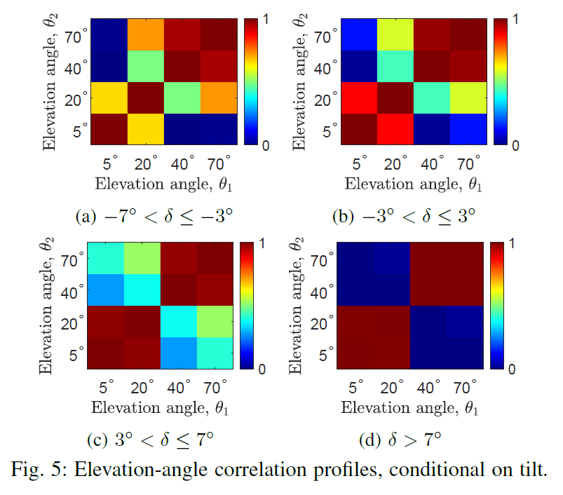
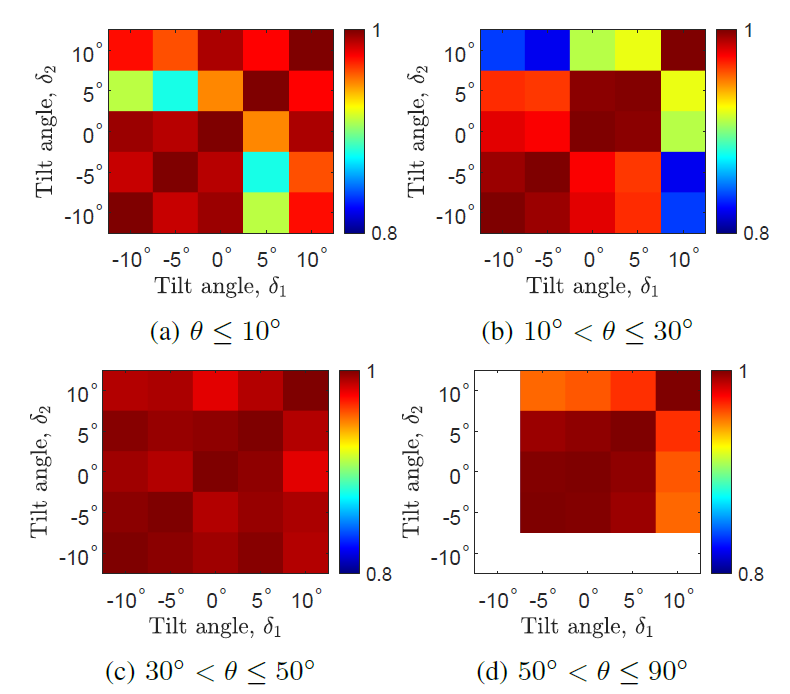
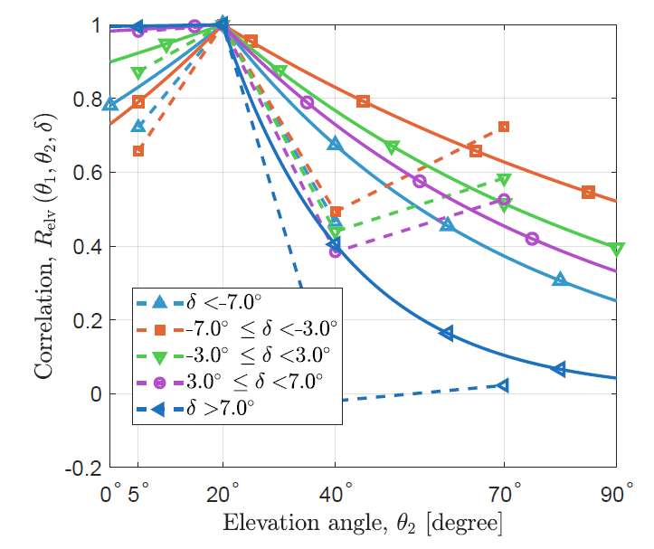
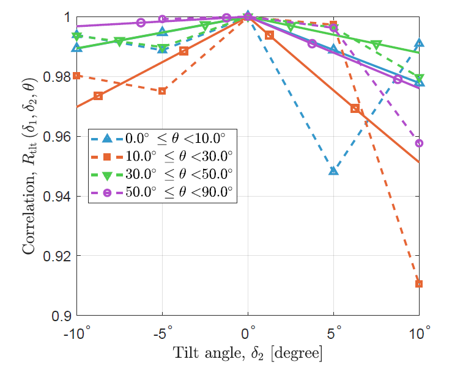
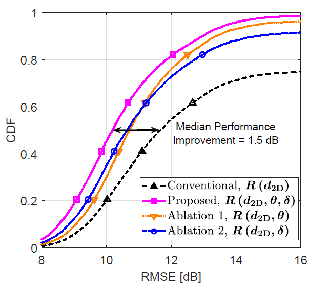
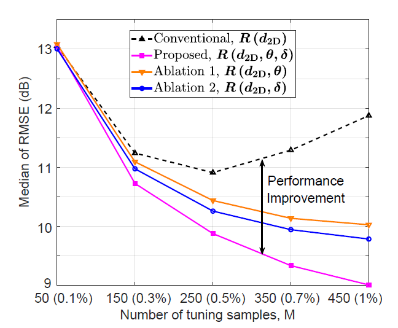

# Shadow Fading Angular Correlation

This repository contains the code implementation for the research paper titled **Elevation- and Tilt-Aware Shadow Fading Correlation Modeling for UAV Communications**. The paper focuses on **modeling the correlation variation of shadow fading with UAV elevation and tilt angle changes**. This code allows you to replicate the experiments described in the paper and explore the results.

## General Introduction

In this paper, we investigate **effect of UAV elevation and tilt angle on shadow fading**. The goal of the study was to **integrate angular information into shadow fading correlation modeling**, and this code demonstrates the experimental setups, data processing pipelines, and the results we obtained.

### Key Highlights:
- **Approach**: We used **biexponential spatial correlation modeling, exponential angular correlation model, ordinary Kriging interpolation**
- **Data**: The dataset used in this research consists of **AERPAW AFAR Challenge Dataset** ([link](https://aerpaw.org/dataset/aerpaw-find-a-rover-afar-challenge-in-december-2023/)).
- **Results**: The findings from the research indicate that **(1) UAV tilt and elevation angles can reduce correlation up to 15% and 40%, (2) Proposed angle-aware correlation model improves Kriging performance**.

This repository is provided to help reproduce the experiments and facilitate future research in this domain.

## How to Run This Code

### Prerequisites

Before running the code, make sure you have the following installed:

- Matlab R20022b or newer
- Required Matlab addons:
  - `Optimization Toolbox`
  - `Symbolic Math Toolbox`
  - `Signal Processing Toolbox`


# Running the Code

### Clone the Repository:

To get started, clone this repository to your local machine:

```bash
git clone https://github.com/MPACT-Lab/shadow-fading-ang-corr.git
```

### Running Specific Modules:

- **Data Preprocessing**:

To calculate the tilt angle and preprocess data from raw UAV measurements:

```bash
cd data_gen
```
then run ```data_gener_afar_asilomar.m```.

- **Angular Correlation Model Training**: 

To learn the angular correlation mdoel of shadow fading:

```bash
cd corr_profile
```
then run ```spatial_and_angular_correlation_prof_learning.m```.

- **Evaluation of Proposed Correlation Model**: 

```bash
cd REM_reconstruction
```
then run ```test_ordinary_kriging.m``` to use ordinary Kriging to predict radio environment map (REM) using the correlation models. The scripts calculates and plots the RMSE values of prediction for the proposed and conventional correlation models.

You can also run ```test_ordinary_kriging_graphical_example.m``` to visualize predicted shadow fading maps with the proposed correlation model and conventional (DEDM) correlation model.


## Expected Outputs

### Data Preprocessing: 
This step will process the raw dataset and save those within `data_gen/processed_data` folder.


### Model Training: 
This step trains the model and saves the correlation model coefficients within `corr_profile/learned_profile` folder.

Also, the conditional CDF plots of shadow fading, angular correlation tables, and exponential model plots will pop up.

|  | |
|--------------------------------------------------|--------------------------------------------------|
|  |  |


### Model Evaluation: 

The performance of proposed and conventional correlation model will be evaluated as the RMSE of REM construction. Conventional method: uses only spatial distance, proposed method: used spatial distance, elevation angles, tilt angles.

|  | |


## License

This code is released under the MIT License. <!--See the [LICENSE](LICENSE) file for more details.-->

## Citing This Work

If you use this code or refer to the work in your own research, please cite the following paper:

**Mushfiqur Rahman, Ismail Guvenc, Mihail Sichitiu, Jason A. Abrahamson, Bryton J. Petersen, Amitabh Mishra, and Arupjyoti Bhuyan**. "Elevation- and Tilt-Aware Shadow Fading Correlation Modeling for UAV Communicat." *in proc. Asilomar Conference on Signals, Systems, and Computers*, 2025. <!-- [Volume], [Pages]. DOI: [DOI Number].-->

For more information, please refer to the full paper.
<!--## Acknowledgements

- **[Any Contributors or Funding Sources]**
- The authors would like to thank **[Individuals or Organizations]** for their support.

For more information, please refer to the full paper: **[Link to the paper]**.-->

## Contact

If you have any questions, feel free to open an issue or contact us at **iguvenc@ncsu.edu**.
